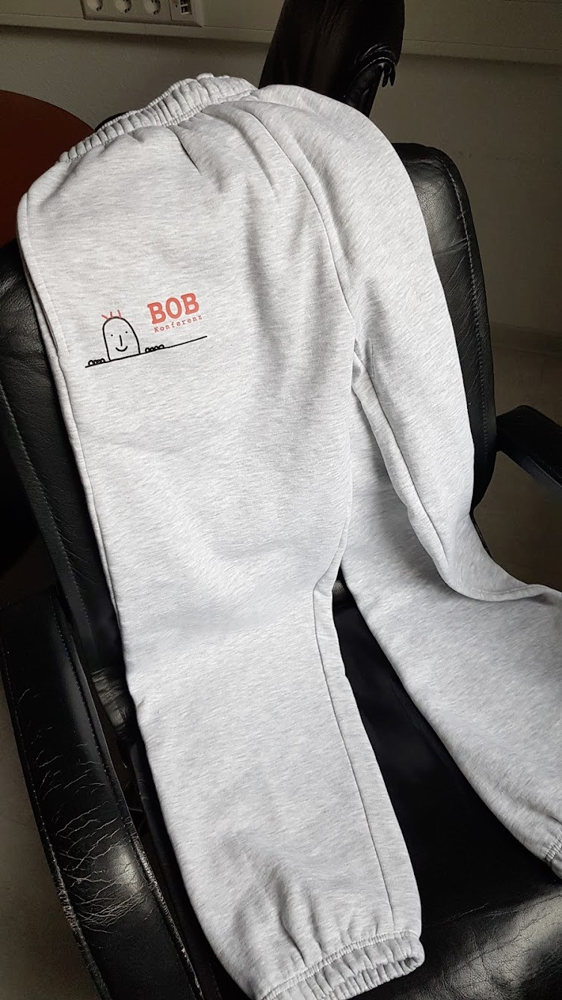

## Recording

For your BOB talk, we'll need to you to provide a pre-recorded video.
If you have a working setup that you like, you can use that, as long
as it provides reasonable output in a reasonably standard format.

The preferred format is 16:9 at 1280x720 at 30FPS.

Talk slots are 45 minutes.  Ideally your recording is 35 minutes,
leaving 10 minutes for Q&A.

If you don't, here are some notes on a working setup using [Open
Broadcaster Software](https://obsproject.com/), which is available for
all major platforms.  It allows you to combine slides, a video of your
face, and other elements into one coherent recording.

The documentation is pretty good, so here's just a quick guide to get
you up and running with a simple setup consisting of audio, a slide
show, a video feed, and a logo.

- Download and start OBS.

- Go to `Preferences` -> `Video`, set both base and output resolution
  to 1280x720, 30FPS.

- You'll see a window with a blank area representing a *scene*, which
  is a particular arrangement of audio and video sources.  For a
  simple talk, you can just use the default scene called `Scene` in
  the list at the bottom left.
  
- At the bottom, there's an Audio Mixer.  Make sure it receives the
  audio from your microphone.  If not, you neeed to add an audio
  source.  To to that, click the `+` button in the `Sources` window in
  the bottom row, select `Audio Input Capture`, select `Create new`,
  and give it a name.  In the next screen, you can (hopefully) select
  your audio device.
  
- Start up whatever software you use to display slides, make it
  display the slides in a window.  Then go back to OBS, again click
  the `+` button in the `Sources` window in the bottom row, select
  `Window Capture`, select `Create new`, and give it a name.  In the
  next screen, you can (hopefully) select your window.  If it doesn't
  show up in the list, you may need to select `Show Windows with empty
  names`.
  
- If you have multiple displays, you can also do a `Display Capture`
  instead of a `Window Capture`, which is better suited for coding
  demos, as it also shows popup menus, the mouse pointer etc.
  
- Similarly, add a video source. click the `+` button in the `Sources`
  window in the bottom row, select `Video Capture Device`, select
  `Create new`, and give it a name.  In the next screen, you can
  (hopefully) select your camera.

- You can now arrange and resize the video and window feeds to your
  satisfaction.
  
- If you want to add a logo, again go to `+` in `Sources`, select
  `Image`, and select an image file.
  
- You can then record your talk by clicking on `Start Recording` in
  the lower right corner.  (That button turns into `Stop Recording`.)
  OBS will just start and pick a file name automatically.  There's a
  menu item `File` -> `Show Recordings` that will show you where it
  is.
  
- Generally, YouTube is full of OBS tutorials.
  [Here's](https://www.youtube.com/watch?v=zTjVBlnEiNI) one that
  explains the basics.
  
- If you encounter any issues, get in touch with
  `michael-sperber@active-group.de`.

## Swag

Pick what kind of swag you'd like and mail your choice (along with a
postal delivery address) to `konferenz@bobkonf.de`.

### Thermos

{:height="500px"}

### Jogging Pants

{:height="500px"}

### Towel

{:height="300px"}

### Puzzle

{:height="400px"}
